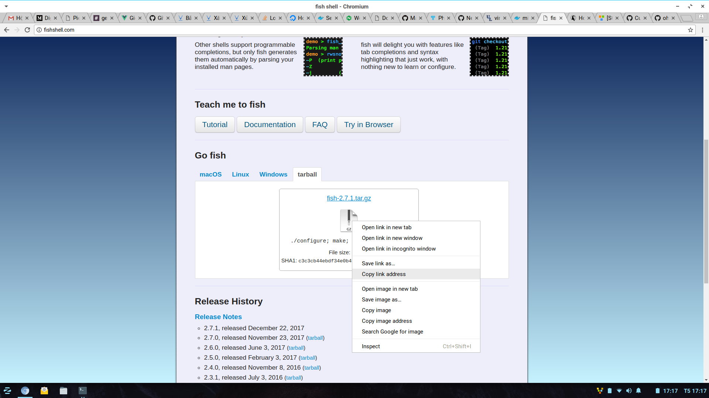

# Tạo mới Docker Image 
## Khởi tạo container al phiên bản alpine:latest 
```shell
docker run -it --name al alpine:latest
```
## update và upgrade cho phần mềm 
```shell
apk update
apk upgrade 
```
## Bổ xung các thêm các gói: 
```shell
apk add git tree vim htop curl ncurses ncurses-dev util-linux groff bc
```
### Xem thông tin fish hiện có: 
```shell
apk search fish 
```
### Tuy nhiên để cài đặt phiên bản fish mới nhất cần thực hiện như sau: 
* Copy link phiên bản fish binary mới nhất: 
 
* Thực hiện download: 
```shell
wget https://github.com/fish-shell/fish-shell/releases/download/2.7.1/fish-2.7.1.tar.gz
```
* Thực hiện giải nén:
```shell
tar -zxvf fish-2.7.1.tar.gz
```
* Thực hiện xóa file .tar để giảm dung lượng layer writable của container: 
```shell
rm fish-2.7.1.tar.gz
```
* Truy cập vào fish-2.7.1 
```shell
cd fish-2.7.1
```
* Cấu hình cho image theo hướng dẫn: 
```shell
./configure
```
* Để fix lỗi: 
```shell 
checking if autoreconf needs to be run... no
checking if autoheader needs to be run... no
checking for gcc... no
checking for cc... no
checking for cl.exe... no
configure: error: in `/fish-2.7.1':
configure: error: no acceptable C compiler found in $PATH
See `config.log' for more details
```
thực hiện câu lệnh sau:
```shell
apk add build-base
```
tiếp tục: 
```shell
./configure
```
* Thực hiện tiếp 2 lệnh sau: 
```shell
make
```
```shell
make install
```
* Chọn fish
```shell
fish
```
* Cài oh my fish: fishshell này có tác dụng thay thế cho /bin/ash hoặc /bin/bash và có thêm tính năng gợi ý.
```shell
curl -L https://get.oh-my.fish | fish
```
* Note: Hoàn thành bước này đã cài xong fish shell bản mới nhất với theme mặc định
* Thay đổi sang theme budspencer 
```shell
omf install budspencer
```
* Liệt kê các theme, plugin cài bởi oh my fish 
```shell
omf list
```
Trường hợp không show được list, cần cài bổ xung: 
```shell 
apk add util-linux
```
* Cài thêm 2 thư viện quan trọng cho fish shell: 
```shell
apk add groff bc
```
* Khi exit thấy các thông báo không cần thiết thì ẩn như sau: 
```shell
set -U budspencer_nogreeting
```
## Cài gói bash để chạy bash script trong Alpine:latest 
* Vào trình vim: 
```shell 
vim demo.sh
```
* Chuyển sang chế độ Insert bằng cách chọn phím 'i' và thêm code: 
```shell
#!/bin/bash
# Basic while loop
counter=1
while [ $counter -le 10 ]
do
  echo $counter
  ((counter++))
done
  echo All done
```
* Thoát vim bằng ':wq'
* ls để kiểm tra file demo.sh
```shell
BSDmakefile              README.md                demo.sh                  lexicon_filter.in
CHANGELOG.md             build_tools              doc_src                  m4
CONTRIBUTING.md          config.guess             etc                      obj
COPYING                  config.h                 fish                     osx
Dockerfile               config.h.in              fish.pc                  pcre2-10.22
Doxyfile                 config.log               fish.pc.in               po
Doxyfile.help            config.status            fish.spec.in             share
Doxyfile.user            config.sub               fish.xcodeproj           src
FISH-BUILD-VERSION-FILE  configure                fish_indent              tests
Makefile                 configure.ac             fish_key_reader          user_doc
Makefile.in              configure.lineno         install-sh               version
```
* Cấp quyền chạy cho demo.sh
```shell 
chmod +x demo.sh
```
và chạy thử: 
```shell 
./demo.sh
```
* Note: không chạy được vì thiếu gói bash 
```shell 
apk add bash 
```
Chạy thành công: 
```shell 
./demo.sh                                                                              /fish-2.7.1 
1
2
3
4
5
6
7
8
9
10
```
## Giảm kích thước container 
* Kiểm tra size image hiện tại
```shell 
docker ps -a --format '{{.Names}} {{.Size}}'
```


# Dockerfile 
## Khởi tạo một container phiên bản image alpine:latest 
```shell
docker run -it --name demo1 alpine:latest
````
* Phiên bản này chỉ có các phần mềm cơ bản như top, vi chứ không có sẵn htop, git, curl, vim 
```shell
/ # top 
Mem: 3026024K used, 13270684K free, 262860K shrd, 109448K buff, 956556K cached
CPU:   0% usr   0% sys   0% nic  98% idle   0% io   0% irq   0% sirq
Load average: 0.46 0.53 0.61 2/824 7
  PID  PPID USER     STAT   VSZ %VSZ CPU %CPU COMMAND
    1     0 root     S     1588   0%   6   0% /bin/sh
    7     1 root     R     1524   0%   0   0% top
    
/ # vi
~
~
~
~
~
~
~
~
~
~
~
~
~
~
~
~
~
~
~
~
~
~
- No file 1/1 100%
```
```shell
/ # git
/bin/sh: git: not found
/ # curl
/bin/sh: curl: not found
/ # vim
/bin/sh: vim: not found
```
* Ngược lại phiên bản coolalpine đã có sẵn hầu hết các phần mềm cơ bản: git, curl, vim 


