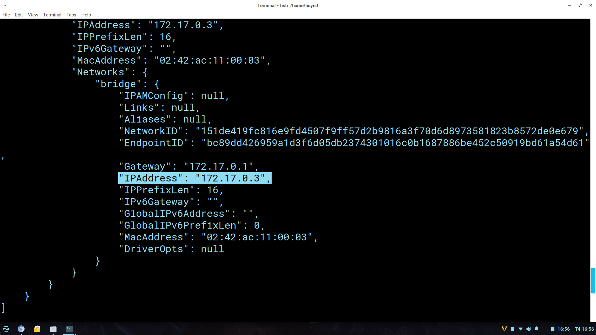
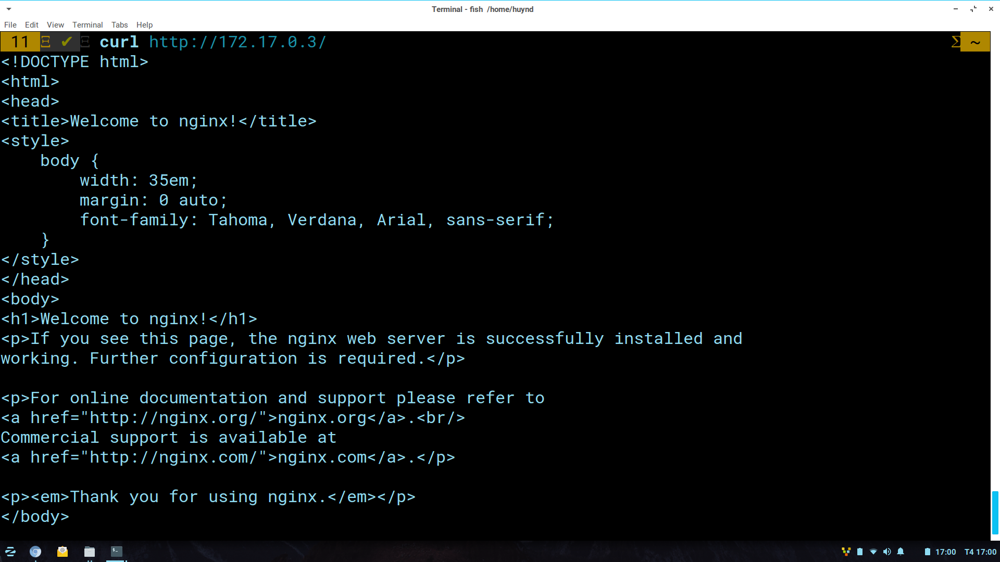
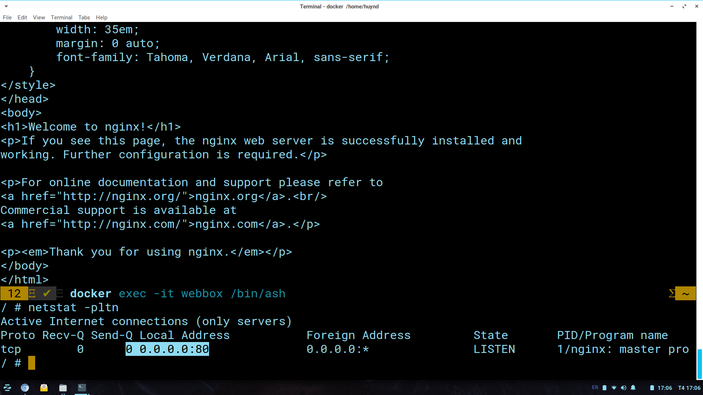
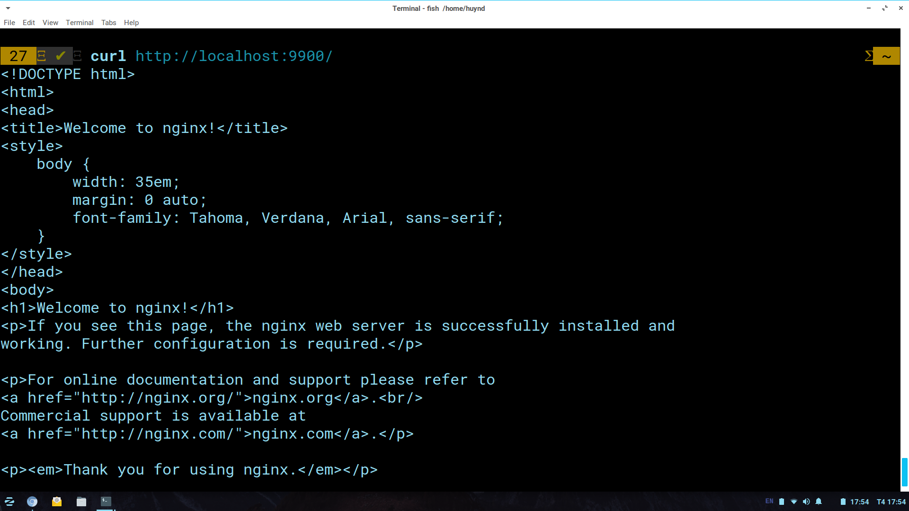

# Nối cổng từ Container vào Host 
## Bước 1: Khởi tạo 1 webbox mới 
```
docker run -it --name webbox nginx:alpine 
```
## Bước 2: Lấy địa chỉ ip của webbox 
```
docker inspect webbox 
```

### Xem nội dung webbox 
```
curl http://172.17.0.3
```

## Bước 3: Kiểm tra container đang lắng nghe ở cổng nào?  
* Truy cập vào container webbox: 
```
docker exec -it webbox /bin/ash
```
* Thực hiện lệnh: 
```
netstat -pltn
```

### Note: Cổng lắng nghe của container là: 80
## Bước 4: Ánh xạ cổng container vào cổng host
### Cần rm webbox đang chạy: 
```
docker stop webbox; docker rm webbox 
```
### Tạo webbox mới có ánh xạ cổng 9900:
```
docker run -it --name webbox -p 9900:80 /bin/ash
```
## Bước 5: Kiểm tra kết quả 
```
curl http://localhost:9900/
```

