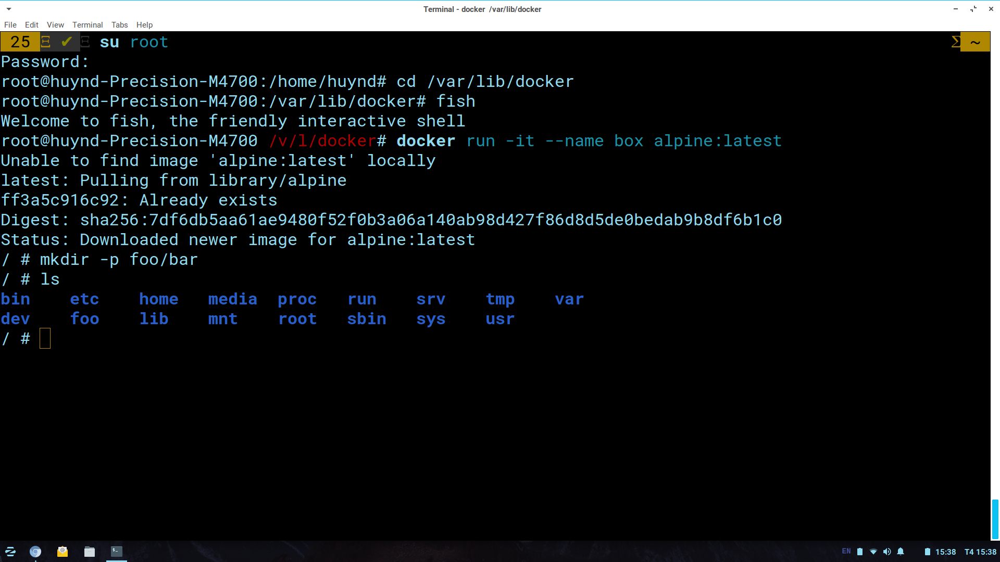

# Hack vào thư mục lưu trữ của Docker
## Setup ban đầu: 
* Cấp quyền root: su root 
* Truy cập vào thư mục lưu trữ của Docker
```
cd /var/lib/docker 
```
* Sử dụng fish để thuận tiện cho việc di chuyển 
```
fish 
```
Output setup: 
```                                                                           
root@huynd-Precision-M4700:/home/huynd# cd /var/lib/docker
root@huynd-Precision-M4700:/var/lib/docker# fish
Welcome to fish, the friendly interactive shell
root@huynd-Precision-M4700 /v/l/docker# 
```

## Bước 1: Khởi tạo 1 container mới có tên box 
```
docker run -it --name box alpine:latest
```
## Bước 2: Tạo sự thay đổi trong container bằng cách thêm  thư mục foo (trong thư mục foo có chứa thư mục bar) 
```
mkdir -p foo/bar
```
Thêm thành công: 

## Bước 3: Kiểm tra containers/
### Kiểm tra id container của box 
```
docker ps -a | grep box
```
### Truy cập vào thư mục containers/ trong docker 
```
containers/
```
### Truy cập vào container của box thông qua id container 
```
4b184d31ac3ba0f8dd3d3e5b1c560a871aa5520f1bf4796dc3e4424c333541db/
```
### Liệt kê các file trong container box 
```
ls
```
### Output: Không tìm thấy thư mục foo 


Note: Trong containers/ chỉ chứa các thông tin cấu hình của container chứ không chứa những thay đổi của container 
## Bước 3: Truy cập vào thư mục overlay2 trong docker 
```
overlay2/
```
### Thực hiện lệnh ls sẽ liệt kê tất cả các id container base 
## Bước 4: Để tìm kiếm thư mục foo thực hiện
```
find . -iname "foo"
```
### Output: Xuất hiện thư mục foo trong file diff 

### Note: 
* Như vậy mọi thay đổi của container sẽ được lưu trữ trong thư mục overlay2/
* Từ host có thể thực hiện việc tìm kiếm và thay đổi container, tuy nhiên việc làm này là không nên vì đôi khi có thể làm corrupt container.
